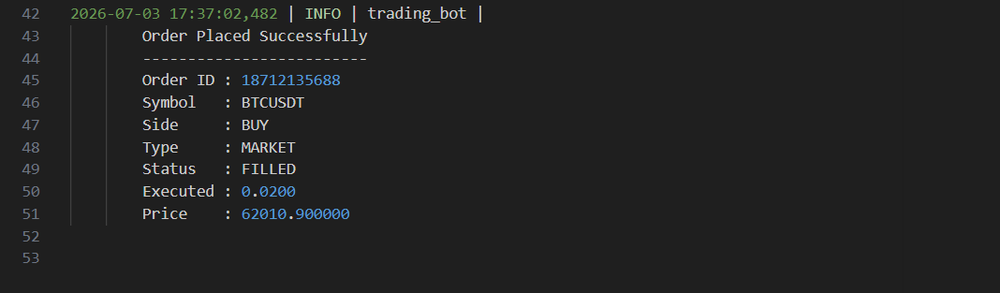
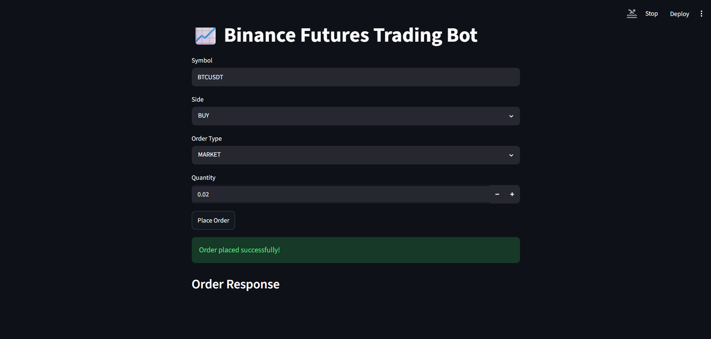
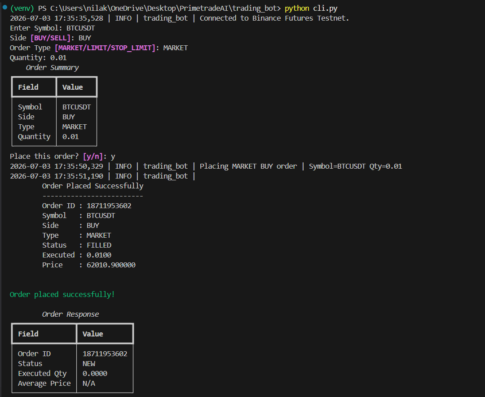

# Binance Futures Trading Bot

## Features

- Market Orders
- Limit Orders
- Stop-Limit Orders
- CLI Interface
- Streamlit UI
- Logging
- Validation

## Folder Structure

trading_bot/
│
├── bot/
│   ├── __init__.py
│   ├── client.py          # Binance client wrapper
│   ├── config.py          # Configuration values
│   ├── logging_config.py  # Logging setup
│   ├── orders.py          # Order placement logic
│   └── validators.py      # Input validation
│
├── ui/
│   └── app.py             # Streamlit UI
│
├── logs/
│   ├── trading.log
│   ├── market_order.log
│   └── limit_order.log
│
├── cli.py                 # CLI entry point
├── .env                   # API credentials (not committed)
├── requirements.txt
└── README.md

## Installation

git clone ...

pip install -r requirements.txt

## Configure

Create .env

API_KEY=
API_SECRET=

## Run CLI

python cli.py

## Run UI

streamlit run ui/app.py

## Example

## Logs

logs/trading.log

## Assumptions

- The application uses the Binance Futures Testnet/Demo environment.
- Users have valid Binance Testnet API credentials stored in a `.env` file.
- The trading symbol is valid (e.g., BTCUSDT).
- LIMIT and STOP_LIMIT orders require a valid price.
- The account has sufficient demo balance for order execution.